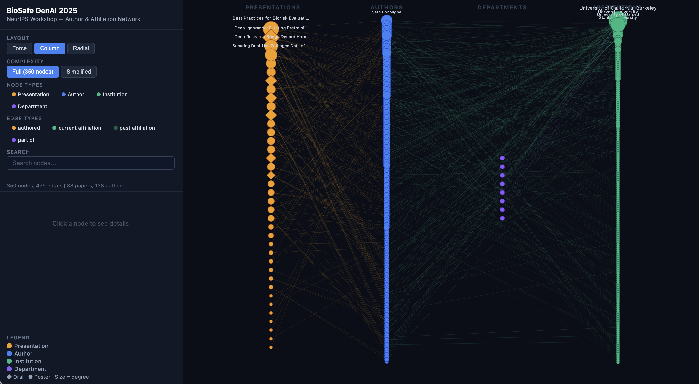

# BioSafe GenAI 2025 — Author-Affiliation Network

Interactive network visualization of all accepted papers (oral + poster) at the [NeurIPS 2025 Workshop on Biosecurity Safeguards for Generative AI (BioSafe GenAI)](https://openreview.net/group?id=NeurIPS.cc/2025/Workshop/BioSafe_GenAI).

**[Live Demo](https://chenhsieh.github.io/biosafe-genai-network/)** ← replace after enabling GitHub Pages



## What This Is

A knowledge graph mapping the **350 nodes** and **479 edges** connecting presentations, authors, and their institutional affiliations from the BioSafe GenAI 2025 workshop. Built to surface research clusters, institutional networks, and thematic niches in the emerging field of AI biosecurity.

### At a Glance

| | Count |
|---|---|
| Papers | 38 (6 oral, 32 poster) |
| Unique authors | 138 |
| Institutions | 166 |
| Departments | 8 |

### Key Findings

- **Dominant institutions**: UC Berkeley (9 authors), Princeton (7), SecureBio (7), Oxford (7), Harvard (5), Stanford (5)
- **Most prolific author**: ZAIXI ZHANG (4 papers — DNA jailbreaking, protein red-teaming, watermarking)
- **Tightest cluster**: ZAIXI ZHANG / Ruofan Jin / Mengdi Wang / Le Cong — Princeton + Stanford axis, 3 papers together
- **Emerging orgs**: Algoverse AI Research (5 authors, 2 papers) — a student research org bridging undergrads into NeurIPS-level biosecurity research
- **7 solo-author papers** — suggesting a nascent field where individuals are staking territory
- **Governance gap**: Only 7 policy-oriented papers, mostly from a single group — no major policy institutions publishing here yet

## Features

- **3 layouts**: Column (default, grouped by type), Force-directed (clustered), Radial
- **Click-to-select**: Click any node to lock selection; connected edges stay highlighted while panning/zooming
- **Detail panel**: Shows OpenReview links, Google Scholar, DBLP, LinkedIn, personal homepages
- **Filters**: Toggle node types (presentation/author/institution/department) and edge types
- **Search**: Find any node by name
- **Simplified mode**: Hide low-connectivity institutions to reduce visual clutter
- **Fully static**: Zero runtime physics — all layouts pre-computed, no jitter

## Data

All data was extracted from the [OpenReview API](https://api2.openreview.net) and enriched with author profile information.

| File | Description |
|---|---|
| `data/graph_data.json` | Full graph with nodes, edges, and metadata |
| `data/nodes.csv` | All 350 nodes with type, degree, URL, details |
| `data/edges.csv` | All 479 edges with source, target, type |
| `data/raw_data.json` | Raw extraction including full author profiles and affiliations |

### Node Types

| Type | Color | Count |
|---|---|---|
| Presentation | Amber | 38 |
| Author | Blue | 138 |
| Institution | Green | 166 |
| Department | Purple | 8 |

### Edge Types

| Type | Count | Description |
|---|---|---|
| `authored` | 163 | Author → Presentation |
| `current_affiliation` | 172 | Author → Current institution |
| `past_affiliation` | 136 | Author → Former institution |
| `part_of` | 8 | Department → Institution |

## Reproduce

```bash
# 1. Extract papers and author profiles from OpenReview
python scripts/extract_data.py

# 2. Build the graph data structure
python scripts/build_graph.py

# 3. Generate the interactive HTML
python scripts/generate_html_v3.py
```

Requires Python 3.8+. No external dependencies (uses only stdlib).

## Deploy to GitHub Pages

1. Push this repo to GitHub
2. Go to Settings → Pages → Source: "Deploy from a branch" → Branch: `main`, folder: `/ (root)`
3. Your visualization will be live at `https://YOUR_USERNAME.github.io/biosafe-genai-network/`

The `index.html` is fully self-contained (all data embedded, no external dependencies).

## License

Data sourced from [OpenReview](https://openreview.net) under their terms of use. Visualization code is MIT licensed.

## Citation

If you use this visualization or dataset in your work:

```bibtex
@misc{biosafe_genai_network_2025,
  title={BioSafe GenAI 2025: Author-Affiliation Network Visualization},
  author={Chen Hsieh},
  year={2025},
  url={https://github.com/YOUR_USERNAME/biosafe-genai-network}
}
```
